# Traffic Sign Recognition Program

# Overview

In this project, I use the [German Traffic Sign Dataset](http://benchmark.ini.rub.de/?section=gtsrb&subsection=dataset) to train custom _covnet_ based on the LeNet model. The training/validation and test sets consist of already cropped images from the original dataset and split/saved into the python's _pickle_ format.

**Summary of the Dataset**
|Summary|Value|
|--|--|
|Number of training examples | 34799|
|Number of testing examples | 12630|
|Image data shape | 32x32x3|
|Number of classes | 43|

The distribution of the classes in the Training/Validation and Test datasest in not uniform. Some signs have substantially more traing examples then others:

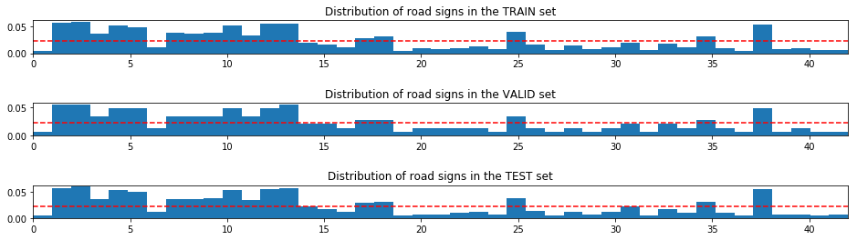

The Dataset consists of 43 different traffic signs, which is only a small portion of all possible german traffic signs. The signs included in the train set are as follows:

|Value|Corresponding Traffic Sign|
|-----:|:------------|
|0|Speed limit (20km/h)|
|1|Speed limit (30km/h)|
|2|Speed limit (50km/h)|
|3|Speed limit (60km/h)|
|4|Speed limit (70km/h)|
|5|Speed limit (80km/h)|
|6|End of speed limit (80km/h)|
|7|peed limit (100km/h)|
|8|Speed limit (120km/h)|
|9|No passing|
|10|No passing for vehicles over 3.5 metric tons|
|11|Right-of-way at the next intersection|
|12|Priority road|
|13|Yield|
|14|Stop|
|15|No vehicles|
|16|Vehicles over 3.5 metric tons prohibited|
|17|No entry|
|18|General caution|
|19|Dangerous curve to the left|
|20|Dangerous curve to the right
|21|Double curve|
|22|Bumpy road|
|23|Slippery road|
|24|Road narrows on the right|
|25|Road work|
|26|Traffic signals|
|27|Pedestrians|
|28|Children crossing|
|29|Bicycles crossing|
|30|Beware of ice/snow|
|31|Wild animals crossing|
|32|End of all speed and passing limits|
|33|Turn right ahead|
|34|Turn left ahead|
|35|Ahead only|
|36|Go straight or right|
|37|Go straight or left|
|38|Keep right|
|39|Keep left|
|40|Roundabout mandatory|
|41|End of no passing|
|42|End of no passing by vehicles over 3.5 metric ...|

### Example of the training traffic signs:

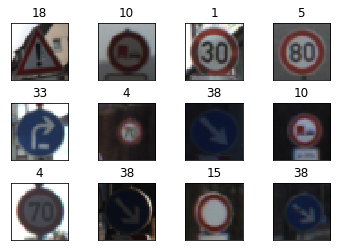

### Preprocessing

#### Input
The datasets contain pixel information as the `int32` format in the range [0, 255]. After experimenting with normalization of the input information using similar technique to the one used in the VGG network where the **mean** calculated on all channels of the training data is deducted from the pixel value of the input data and divided by the channel's **standard deviation**.

$\text{normalized input} = \frac{\text{input} - \text{channel's mean}{\text{channel's standard deviation}$

I could not get a satisfactory results using that method of normalization (around 0.40 validation accuracy). Leaving the input data in the original format turned out to have much better results.

I used the data in RGB format in order to be able to see the difference between the signs of the same shape but different meaning based on the sign's color.

#### Output
I one-hot encoded the value of the labels into a vector with the length 43.

## Covnet model

In my model I use two separate covnet pipelines with added outputs, which is fed into the fully-connected layer.

|Name|Kernel Size|Kernel Depth|Stride|Padding|Output Size|
|-|-|-|-|-|-|
|Input|||||32x32x3|
|conv1+ReLU|5x5|18|(1, 1, 1, 1)|VALID|28X28X18|
|Maxpool|2x2|18|(1, 2, 2, 1)|VALID|14x14x18|
|conv2+Relu|5x5|64|(1, 1, 1, 1)|VALID|10x10x64|
|Maxpool|2x2|64|(1, 2, 2, 1)|VALID|5x5x64|
|Output(Flatten)|||||1600|

Outputs of two separate covnets are added and fed into the following neural network:

|Layer|Layer Size|Activation|
|-|-|-|
|Input|1600|None|
|Layer 1+Dropout|512|ReLU|
|Layer 2|256|ReLU|
|Output|43|None|

As a measure to prevent overfitting I have used the _dropout_. I have also tried to use _batch normalization_, but it was bringing the validation accuracy down to around 0.50.

#### Optimization
I have chosen an _Adam_ optimizer as it supports learning rate decay and replaces in most cases traditional _Stochastic Gradient Descent optimization_ method.

#### Hyper-parameters

|Name|Value|
|-|-|
|Learning Rate|0.0003|
|Dropout|0.5|
|Weight initialization: mean|0.0|
|Weight initialization: stdev|0.01|
|Epochs|40|
|Batch Size|128|

#### Training

Validation accuracy reaches 0.93 on the 7th epoch, and then raises slowely up to 0.96

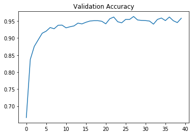

The **test accuracy** on the fully trained network reaches **0.94**, and the **recall-precision score** reaches **0.97**.

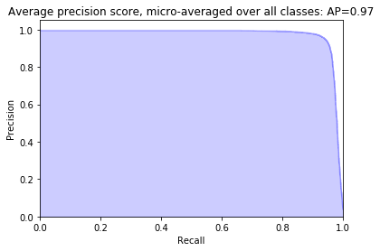

## Validation on new test data

I scrapped 20 new traffic signs from streets of Hamburg/Germany using Google Street View. That new data included signs the network was trained to recognize but also signs that were not in the training dataset.

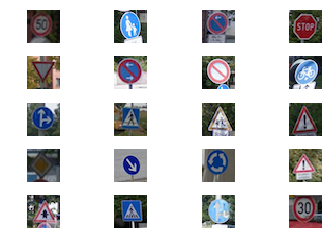

The accuracy of this traffic signs recognition system for the new data is **0.846**.

The network has very strong opinions about the meaning of the signs not included in the traing, which may be an indicator of the network's overfitting. 

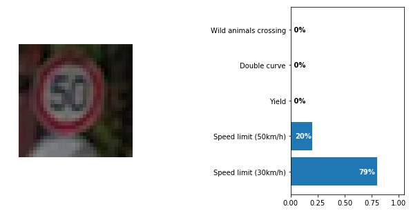
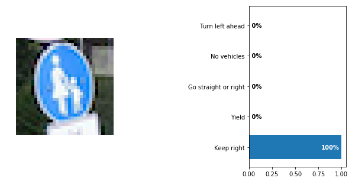
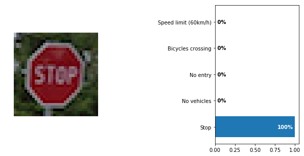
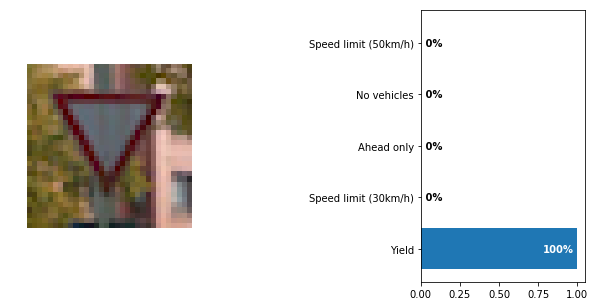
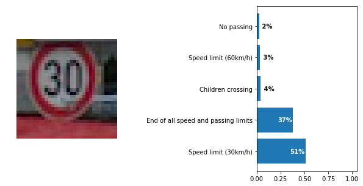

## Visualization of the covnet layer

I used the following traffic sign to see what are the states of the convolutional network layer:

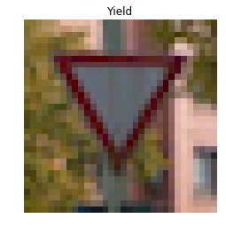

I used the the output of the 2nd covnet layer of the size 10x10x64 to see the responses, which look as follow:

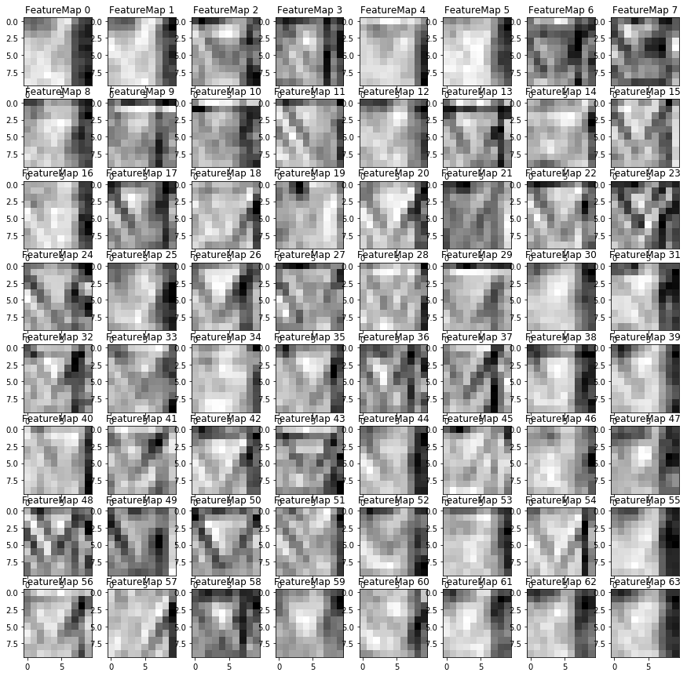

It shows that the region of interest for this particular sign lays in the middle.
